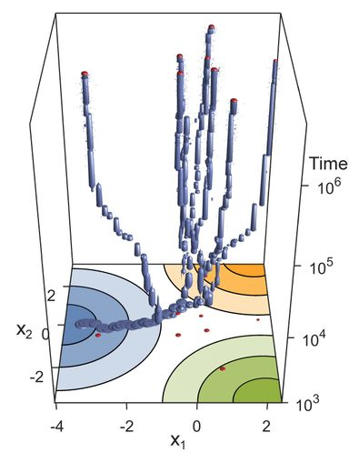

```{r setup, include=FALSE}
knitr::opts_chunk$set(echo = FALSE)
```

::: {.floatting}
```{r out.width='30%', out.extra='style="float:right; padding:10px"'}

```
Biological diversity is staggering and research in our group aims at contributing to our understanding how this diversity arises and how it is maintained. We are particularly interested in the role of ecology in the process of adaptive diversification (eco-evolutionary dynamics). Currently, work in our group is of exclusively theoretical nature: we build and analyze mathematical models to understand the factors that favor or hinder adaptive diversification. These models, rather than focusing on one specific organism, are of primarily conceptual nature.

Diversity arises at many levels of biological organization, in the form of different species, as polymorphism within species, and as polymorphism among modules within an organism. Work in our group addresses all three of these levels.
:::


