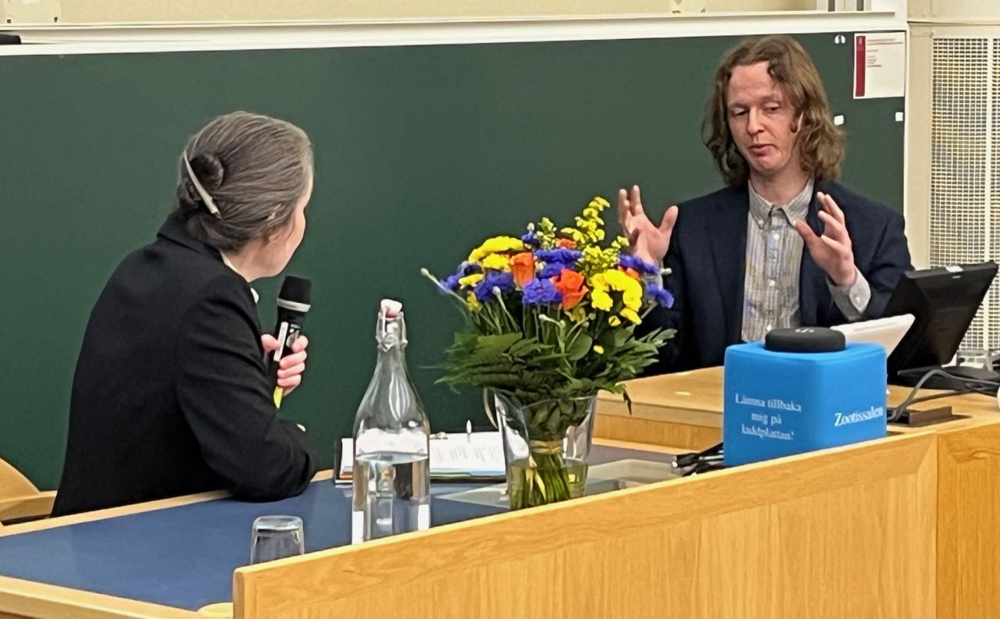

```{r setup, include=FALSE}
knitr::opts_chunk$set(echo = TRUE)
```

### 2024

* New paper co-authored by Claus published in PNAS: *[Central place foragers, prey depletion halos, and how behavioral niche partitioning promotes consumer coexistence](https://www.pnas.org/doi/10.1073/pnas.2411780121)*.

* Welcome to *Olle Wickman* who joins us for his master's thesis. Olle is interested in the role of behavioral habitat choice for species coexistence. He will investigate this question with a combination of analytical and simulation approaches.

* Welcome to *Mattias Finndin* who joins us for his master's thesis. Mattias is interested communities of arctic wader birds and will collect and analyses field observations to understand the role of palsa mires for wader communities.

* New preprint co-authored by *Claus*: *[Central place foragers, prey depletion halos, and how behavioral niche partitioning promotes consumer coexistence](https://www.biorxiv.org/content/10.1101/2024.06.13.598783v1)*.

* A big congratulations to *Mattias* for successfully defending his PhD thesis *[Mathematical Solutions to Divergent Evolution](https://urn.kb.se/resolve?urn=urn:nbn:se:uu:diva-526967)* on 14 June. Many thanks go to *[Eva Kisdi (University of Helsinki, Finland)](https://www.mv.helsinki.fi/home/kisdi/)* for acting as faculty opponent. Eva and Mattias had the most interesting discussion one could hope for at a PhD defense.


* Congratulations to *Izabel* for successfully defending her master's thesis *[Relaxation of the separation between ecological and evolutionary timescales has unexpected effects on community assembly of species with complex life cycles](https://uu.diva-portal.org/smash/record.jsf?dswid=-8544&pid=diva2%3A1893821&c=2&searchType=SIMPLE&language=en&query=izabel+eriksson+reuterborg&af=%5B%5D&aq=%5B%5B%5D%5D&aq2=%5B%5B%5D%5D&aqe=%5B%5D&noOfRows=50&sortOrder=author_sort_asc&sortOrder2=title_sort_asc&onlyFullText=false&sf=all)* and for securing a PhD position in ecological modelling at Linköping University.

* New preprint co-authored by *Mattias* and *Claus*: *[Sex-specific dominance and its effects on allelic diversity in sexually antagonistic loci](https://www.biorxiv.org/content/10.1101/2024.05.06.592709v1)*.

### 2023

* *Claus* gives a talk in the *[Theoretical Ecology Webinar Series](https://iite.info/seminar/)* organized by the *[International Initiative for Theoretical Ecology](https://iite.info/)*. In his talk, he presents work by Marco and Paula on evolutionary diversification and community assembly for species with complex life cycles. You can see a recording of his presentation *[here](https://www.youtube.com/watch?v=trPw2meV6DY)*.

* New paper co-authored by *Mattias* published in The American Naturalist: *[Anisogamy does not always promote the evolution of mating competition traits in males](https://www.journals.uchicago.edu/doi/10.1086/727968)*.

* Welcome to *Izabel Eriksson Reuterborg* who joins us for her master's thesis. Izabel studies at Uppsala University. She is interested in modelling community assembly in consumer species with complex life cycles. To this end, she will get into writing individual-based simulations in R.

* New paper co-authored by *Claus* published in The American Naturalist: *[Resource variation within and between patches: Where exploitation competition, local adaptation and kin selection meet](https://www.journals.uchicago.edu/doi/10.1086/727483)*.

* New paper by *Marco*, *Paula* and *Claus* published in Ecology Letters:
*[Complex life cycles drive community assembly through immigration and adaptive diversification](
https://onlinelibrary.wiley.com/doi/10.1111/ele.14216)*.

### 2022

* A big congratulations to *Paula* for successfully defending her PhD thesis *[Adaptive evolution in multidimensional trait spaces](https://uu.diva-portal.org/smash/record.jsf?pid=diva2%3A1686131&dswid=6054)* on 23 September. Many thanks go to *[Maria Servedio (University of North Carolina, USA)](https://bio.unc.edu/faculty-profile/servedio/)* for acting as faculty opponent.

* New preprint published by *Paula*, *Marco* and *Claus*: *[Consequences of life-cycle complexity to the potential for evolutionary branching](https://www.biorxiv.org/content/10.1101/2022.08.31.506002v2)*.

* Welcome to *Iris van Engen* who joint us for her research training. Iris is an exchange student visting us from the University of Lausanne. She is interested in how trophic cascades due to top-predators can affect diversification and coexistence of consumers at an intermediate trophic level.

### 2021

* Congratulations to *Alexandros* for successfully defending his master's thesis *[Host plant selection in closely related butterfly species due to reproductive interference: Modelling a tritrophic system](https://www.diva-portal.org/smash/record.jsf?dswid=-7126&pid=diva2%3A1606503&c=1&searchType=SIMPLE&language=en&query=alexandros+bantounas&af=%5B%5D&aq=%5B%5B%5D%5D&aq2=%5B%5B%5D%5D&aqe=%5B%5D&noOfRows=50&sortOrder=author_sort_asc&sortOrder2=title_sort_asc&onlyFullText=false&sf=undergraduate)* and for securing a PhD position at the evolutionary ecology group at the University of Antwerp.

* New paper co-authored by *Claus* published:  
*Martinossi-Allibert I., Veller C., Ament-Velásquez S.L., Vogan A.A., Rueffler C. and Johannesson H. (2021) Invasion and maintenance of meiotic drivers in populations of ascomycete fungi. [Evolution 75: 1150-1169](https://onlinelibrary.wiley.com/doi/10.1111/evo.14214).*

### 2020

* *Alexandros Bantounas* starts his master's thesis. Alexandros is interested in modeling the effect of reproducitve interference on the evolution of habitat choice. His research is motivated by the biology of *Leptidea* butterflies.

* *Marco Saltini* joins the lab. Marco has a background in theoretical physics and is now plunging into the world of theoretical evolutionary ecology. He is interested in how ecological niche shifts can affect the potential for adaptive diversification in organims with complex life cycles.

* New paper co-authored by *Claus* published:  
*Ohtsuki H., Rueffler C., Wakano J.Y., Parvinen K. and Lehmann L. (2020) The components of directional and disruptive selection in heterogeneous group-structured populations. [Journal of Theoretical Biology 507: 110449](https://www.sciencedirect.com/science/article/pii/S0022519320303040).*

* New paper by *Paula* and *Claus* published:  
*Vasconcelos P. and Rueffler C. (2020) How Does Joint Evolution of Consumer Traits Affect Resource Specialization? [The American Naturalist 195: 331-348](https://www.journals.uchicago.edu/doi/abs/10.1086/706813?journalCode=an).*

### 2019

* Congratulations to *Paula* for receiving a [Rosemary Grant Advanced Award](https://www.evolutionsociety.org/content/society-awards-and-prizes/graduate-research-excellence-grants.html) from the Society for the Study of Evolution to work on the role of phenotypic plasticity during divergent selection driven by resource specialization.

* New paper co-authored by *Claus* published:  
*Martinossi-Allibert M., Rueffler C., Arnquist G., Berger D. (2019) The efficacy of good genes sexual selection under environmental change. [Proceedings of the Royal Society B 286: 20182313](https://royalsocietypublishing.org/doi/10.1098/rspb.2018.2313).*

* New preprint by *Mattias* and *Claus*:  
*Siljestam M. and Rueffler C. (2019) Heterozygote advantage can explain the extraordinary diversity of immune genes. [bioRxiv: 347344](https://www.biorxiv.org/content/10.1101/347344v3.full).*

### 2018

* A paper co-authored by *Claus* and his former PhD student [Hannes Svardal](https://www.uantwerpen.be/en/staff/hannes-svardal/svardal-lab/) wins the [2018 Marcus W. Feldman Prize in Theoretical Population Biology](https://www.sciencedirect.com/science/article/pii/S0040580917301892#b6).