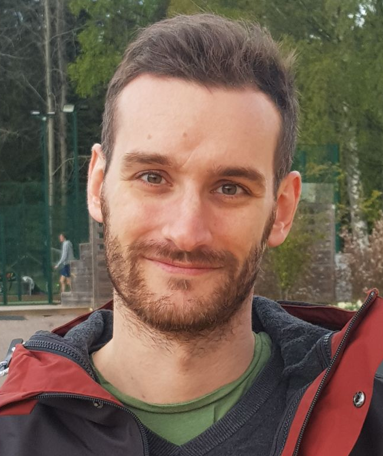
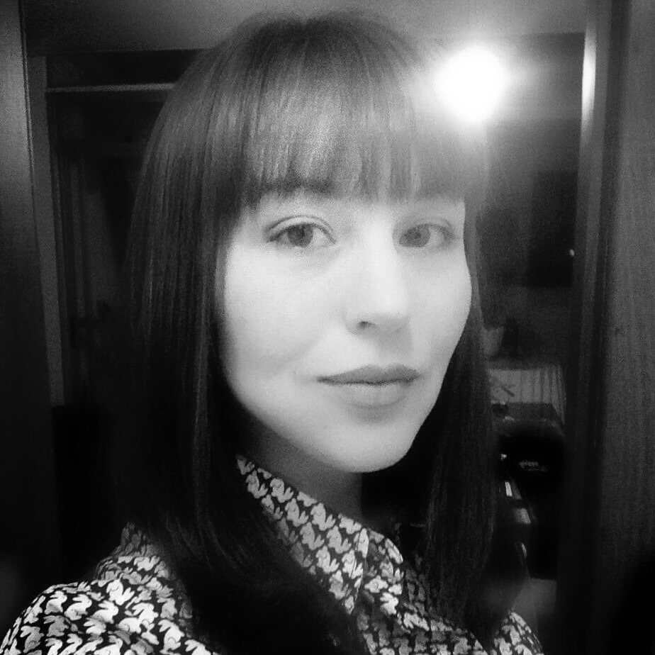

```{r setup, include=FALSE}
knitr::opts_chunk$set(echo = FALSE)
```

### Claus Rüffler (PI)

My name is properly spelled with the German letter "ü". However, in my scientific publications I use the letter combination "ue" instead.

::: {.floatting}
```{r out.width='30%', out.extra='style="float:left; padding:10px"'}
knitr::include_graphics("images/claus.jpg")
```
Tel: +46 (0)18 471 2639  
[Email](mailto:claus.rueffler.ebc.uu.se)  
[Profile at Uppsala University](https://katalog.uu.se/profile/?id=N13-2069)  
[Google Scholar](https://scholar.google.com/citations?user=b28SPdgAAAAJ)  
[Research Gate](https://www.researchgate.net/profile/Claus-Rueffler)
:::


|  |  |
|:---|:-----|
|2013-present|Associate professor, Uppsala University|
|2008-2013|Junior group leader, University of Vienna|
|2005-2007|Postdoctoral fellow, University of Toronto, Advisor: Prof. Peter Abrams|
|2006| PhD, Leiden University, Advisor: Prof. Hans Metz|  
<!--|2009|Research Affiliate (3 month), Yale University, Advisor: Prof. Günter Wagner

Associate editor for Evolution (2016-2018)|-->

### Marco Saltini (posdoc)
::: {.floatting}
```{r out.width='30%', out.extra='style="float:left; padding:10px"'}

```
[Email](mailto:marco.saltini.ebc.uu.se)  
[Profile at Uppsala University](https://katalog.uu.se/profile/?id=N20-692)  
[Google Scholar](https://scholar.google.com/citations?user=PzzFtg4AAAAJ&hl)  

Marco is interested in how ontogentic niche shifts affect the evolution of polymorphism.
:::

### Mattias Siljestam (PhD student)
::: {.floatting}
```{r out.width='30%', out.extra='style="float:left; padding:10px"'}
knitr::include_graphics("images/Mattias.jpg")
```
[Email](mailto:mattias.siljestam.ebc.uu.se)  
[Profile at Uppsala University](https://katalog.uu.se/profile/?id=N14-1246)  

Mattias is interested in the evolution of population level polymorphism that can be interpreted as division of labor.
:::

### Paula Vasconcelos (PhD student)
::: {.floatting}
```{r out.width='30%', out.extra='style="float:left; padding:10px"'}

```
[Email](mailto:paula.vasconcelos.ebc.uu.se)  
[Profile at Uppsala University](https://katalog.uu.se/profile/?id=N15-2232)

Paula is interested in how the simultaneous evolution of several traits can affect the emergence of polymorphism.
:::

### Alexandros Bantounas (master's student)
::: {.floatting}

```{r out.width='30%', out.extra='style="float:left; padding:10px"', echo=FALSE}
# knitr::include_graphics("")
```
Alexandros works on a model investigating how reproductive interference affects the spatial distribution of different hosts in a spatially structured plant-host-parasitoid system.
:::

## Alumni

[Gil Henriques](https://gilhenriques.github.io/) (master's student)