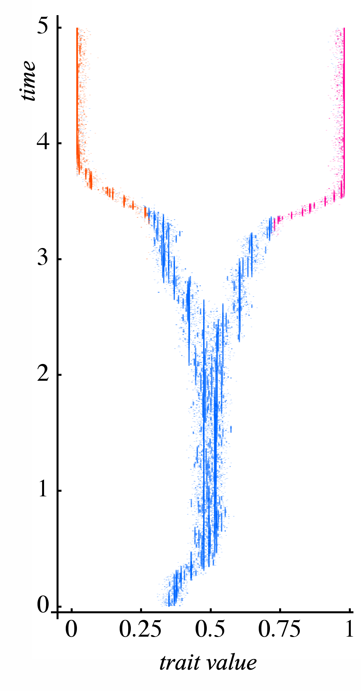

```{r setup, include=FALSE}
knitr::opts_chunk$set(echo = FALSE)
```

We build mathematical models to investigate different questions from ecology and evolution and analyze these with analytical, numerical and simulation techniques. A large part of the work in our lab aims at understanding how ecology and evolution interact in the evolution and maintenance of biological diversity.

::: {.floatting}
```{r out.width='30%', out.extra='style="float:right; padding:10px"'}

```
We use analytical and numerical techniques as well as individual-based computer simulations to analyze our models. A key-tool in our research is phenotypic modeling based on the *adaptive dynamics* approach. Adaptive dynamics refers to a set of techniques designed to study evolutionary change under frequency-dependent selection. The most important feature of adaptive dynamics is that the fitness-value of a specific trait or allele is not assumed a priori but is derived from an explicit ecological scenario accounting for diverse feedbacks between the evolving organisms and their biotic and abiotic environment. Adaptive dynamics can be viewed as a dynamic and ecologically explicit extension of evolutionary game theory.
:::
